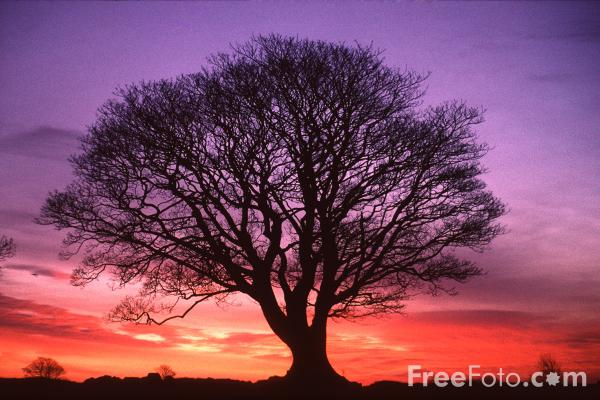
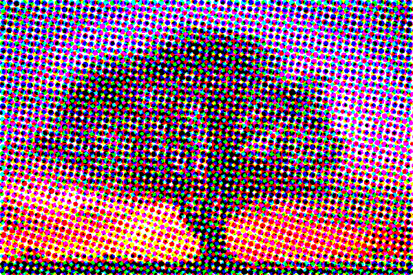

# Image 2 Halftone CMYK



Create a Halftone CMYK Effect for your images. Maybe Photoshop can do this too (I don't know, I don't use PS) but it is more fun to build it your self!

## How to run it
Start the Service with running the App.

```bash
cd ./src
python3 App.py
```

## Required Packages

```bash
python3 -m pip install pillow Flask
```